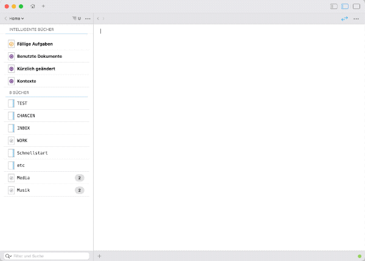

# Notebooks.app Alfred workflow: Quick Open + New Note

[Alfred](https://www.alfredapp.com/) workflow to quickly open and create notes in [Notebooks.app](https://www.notebooksapp.com/). Workflow Icon is (C) NotebooksApp.

## Setup

* Download & double click to install the workflow
* In the install workflow window, set the **folder** to your Notebooks library folder path (you can drag the folder in there)

## Usage

*  `nb` to search file or folder names within the Notebooks library
	*  Enter to open the file in Notebooks
	*  `SHIFT` to copy the `notebooks:` url to clipboard
	* `ALT` to open the file in the default editor 
*  `nbnew` to create a new file in the library root.

## Notes

* If you create a note with a title that is already present, it will be opened
* The workflow searches only for file and folder names. Set the file types you want to include by double-clicking the "nb"-node in the workflow editor
* You can set the extension for new files ("md", "txt") in the install workflow window
* You can set up a fallback search by going to Alfred Settings -> General -> Default results.